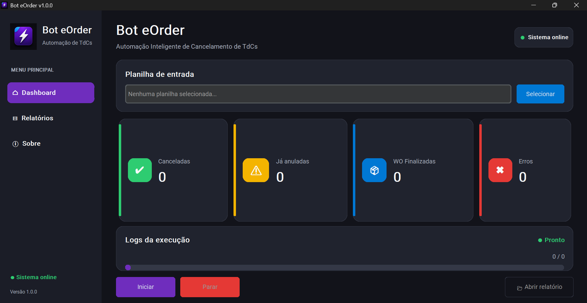
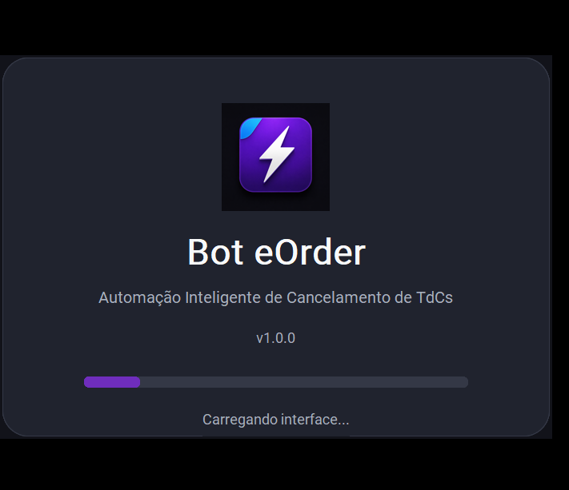
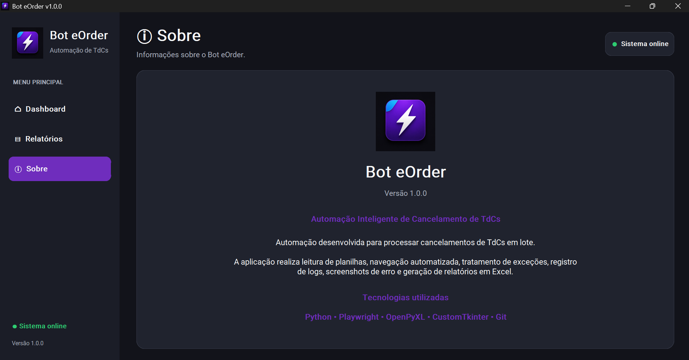
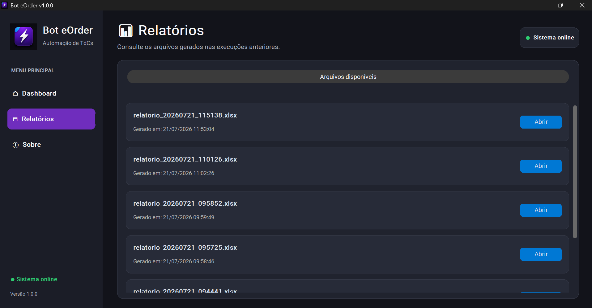

# ⚡ Bot eOrder

Automação desktop desenvolvida em Python para processamento em lote de cancelamentos de TdCs no sistema eOrder.


---
# Interface





# 📌 Sobre

O Bot eOrder automatiza o processo de cancelamento de TdCs utilizando Playwright, eliminando tarefas repetitivas e reduzindo significativamente o tempo gasto em operações manuais.

O sistema possui interface gráfica desenvolvida com CustomTkinter, processamento em lote via planilhas Excel e geração automática de relatórios.

---

# ✨ Funcionalidades

- ✅ Interface gráfica moderna
- ✅ Splash Screen personalizada
- ✅ Login manual no eOrder
- ✅ Processamento em lote
- ✅ Leitura de planilhas Excel
- ✅ Cancelamento automático de TdCs
- ✅ Tratamento de exceções
- ✅ Recuperação automática de erros
- ✅ Logs em tempo real
- ✅ Relatórios em Excel
- ✅ Captura de screenshots em caso de erro
- ✅ Perfil persistente do navegador
- ✅ Executável (.exe)

---

# 🛠 Tecnologias

- Python
- Playwright
- CustomTkinter
- OpenPyXL
- Pillow
- PyInstaller
- Git

---

# 📁 Estrutura

```text
bot-eorder/

assets/
browser/
config/
core/
eorder/
excel/
logs/
relatorios/
screenshots/
ui/
utils/

main.py
version.py
requirements.txt
README.md
```

# 🚀 Como executar

## Ambiente de desenvolvimento

```bash
pip install -r requirements.txt

python main.py
```

## Executável

Execute:

```
BotEorder.exe
```

Faça login no eOrder e clique em **Continuar** para iniciar o processamento.

---

# 📊 Fluxo

```
Excel
      │
      ▼
Leitura das TdCs
      │
      ▼
Login no eOrder
      │
      ▼
Pesquisa da TdC
      │
      ▼
Cancelamento
      │
      ▼
Relatório Final
```

---

# 📈 Resultados

Durante os testes o bot processou:

- ✅ 265 TdCs consecutivas
- ✅ Recuperação automática de erros
- ✅ Continuação do processamento mesmo após exceções
- ✅ Relatórios gerados automaticamente

---

# 📌 Autor

Fernando Alves

LinkedIn:
https://www.linkedin.com/in/fernando-ferreira-alves/

GitHub:
(https://github.com/nandoalvesferreira20-png)

---

# 📄 Licença

Projeto desenvolvido para fins de automação de processos internos.